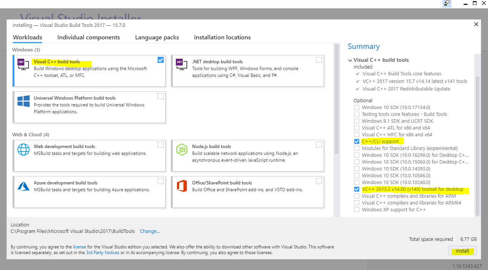

# On your device
___

Prior starting, make sure to have admin rights on your device. While this is not a must-have it will make your life way easier.

## A. Basics

### 1. Install R

https://cran.r-project.org/bin/windows/base/

### 2. Install R Studio (R IDE)
https://www.rstudio.com/products/rstudio/download/

### 3. Data Manipulation
```{r, eval=FALSE}
install.packages('tidyverse')
```

### 4. General ML package
```{r, eval=FALSE}
install.packages('caret')
```

### 5. Others packages in support
```{r, eval=FALSE}
install.packages(c('rmarkdown',
                   'e1071',
                   'mlbench',
                   'ggthemes',
                   'assertthat',
                   'kernlab',
                   'rpart',
                   'rattle',
                   'kknn',
                   'randomForest',
                   'nnet',
                   'RSNNS',
                   'metrics')
)
```


___

## B. Neural Networks

### 1. 64-bit OS
Sorry, this is a must have.

### 2. Install the latest release of [Python](https://www.python.org/downloads/release/python-365/)

- https://www.python.org/ftp/python/3.6.5/python-3.6.5-amd64.exe (Windows)
- https://www.python.org/ftp/python/3.6.5/python-3.6.5-macosx10.9.pkg (Mac OS X 10.9 and later)

Do not forget to set the following **environment variables** on your device

1. *PATH* must point to the directory of python.exe (e.g. C:\\User\\FolderWhereYouInstalledPython)
2. *PATH* must point to the directory of python.exe (e.g. C:\\User\\FolderWhereYouInstalledPython\\**scripts**)


### 3. Interface R - Python
```{r, eval=FALSE}
install.packages('reticulate')
```

### 4. Neural Nets
```{r, eval=FALSE}
install.packages(c('tensorflow',
                   'keras')
)

tensorflow::install_tensorflow()
keras::install_keras() # this may throw an error but work anyway
```

___

## C. Jupyter Notebooks

In case you want to run our amazing notebooks offline. (Requires Python installation)

### 1. Configure stuffs

Do not forget to set the following **environment variables** on your device

- *PATH* must point to the directory of R.exe (e.g. C:\\Program Files\\R\\R-3.5.0\\bin)

```{r, eval=FALSE}
install.packages(c('repr',
                   'IRdisplay',
                   'evaluate',
                   'crayon',
                   'pbdZMQ',
                   'devtools',
                   'uuid',
                   'digest'))

```

Once you have installed the required packages, run this:

```{r, eval=FALSE}
devtools::install_github('IRkernel/IRkernel')
IRkernel::installspec(user = FALSE)
```

**Only if** the command above did not work, please download and unzip [this](https://github.com/IRkernel/IRkernel/archive/master.zip) and run the following:

```{r, eval=FALSE}
devtools::install('whatheverFolderYouHaveUnzippedTheFile\IRKernel')
IRkernel::installspec(user = FALSE)
```

### 2. Install visual Studio Build Tools

- https://www.visualstudio.com/it/thank-you-downloading-visual-studio/?sku=BuildTools&rel=15



### 3. From the CMD line (opened as administrator)
If you wish to use jupyter notebooks
```{r, engine='sh', eval=FALSE}
pip install jupyter
```
If you prefer jupyterlab instead
```{r, engine='sh', eval=FALSE}
pip install jupyterlab
```
Be sure to be in the right hard drive
```{r, engine='sh', eval=FALSE}
C:
```

Start jupyter/jupyterlab (a browser window should magically pop up).
From there, you can source the .ipynb in the folder where you have downloaded it

```{r, engine='sh', eval=FALSE}
jupyter-notebook
jupyter-lab
```

To connection (once you are done), hit CTRL+C twice in the CMD line

___

## D. Cloud

In case you do not manage to execute **A.** and **B.** you can run everything from https://rstudio.cloud
