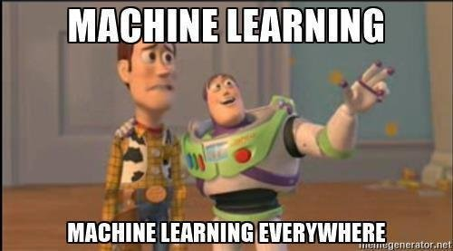

___

### 0.0 [Download Slideshow](https://goo.gl/TFZEyg)
### 0.1 <a href="https://goo.gl/5rhLYK" target="_blank">Teaser Trailer</a>
___

# **Session** *1*
#### *The Basics*

### 1.0 [Download Slideshow](https://goo.gl/xXLBrL)
### 1.1 <a href="https://goo.gl/GSh4FV" target="_blank">Introduction to the Tidyverse</a>
### 1.2 <a href="https://goo.gl/uD7b4w" target="_blank">Machine Learning Libraries in $\texttt{R}$</a>
### 1.3 <a href="https://goo.gl/1CTbkX" target="_blank">K Nearest Neighbors</a>
### 1.4 <a href="https://goo.gl/Ne75mZ" target="_blank">Support Vector Machines</a>
### 1.5 <a href="https://goo.gl/YaAi7s" target="_blank">Tree-based Models</a>
### 1.6 <a href="https://goo.gl/U8HrnG" target="_blank">*Titanic* Dataset</a>

___
# **Session** *2*
##### *Traning Strategies et al.*

### 2.0 [Download Slideshow](https://goo.gl/8eYvWH)
### 2.1 <a href="https://goo.gl/3bXPU6" target="_blank">Bias-Variance Tradeoff</a>
### 2.2 <a href="https://goo.gl/yv2R46" target="_blank">Model Performance</a>
### 2.3 <a href="https://goo.gl/YkMmvr" target="_blank">Model Selection</a>
### 2.4 <a href="https://goo.gl/zGa4GR" target="_blank">Hyperparameter Optimization</a>
### 2.5 <a href="https://goo.gl/juWX6T" target="_blank">*Credit Card Fraud* Dataset</a>

____

# **Session** *3*
##### *Deep Learning*

### 3.0 [Download Slideshow](https://goo.gl/Rtd3FG)
### 3.1 <a href="https://goo.gl/JxUbRV" target="_blank">Introduction to Neural Networks</a>
### 3.2 <a href="https://goo.gl/sGMK2D" target="_blank">Convolutional Neural Networks</a>
### 3.3 <a href="https://goo.gl/imRcr1" target="_blank">Recurrent Neural Networks</a>
### 3.4 <a href="https://goo.gl/iAf2KU" target="_blank">Regularization Techniques</a>
### 3.5 <a href="https://goo.gl/Cnt5ta" target="_blank">Convnets for Text Recognition</a>

___

